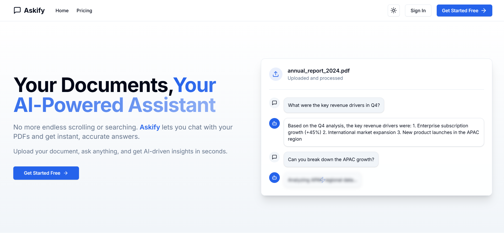
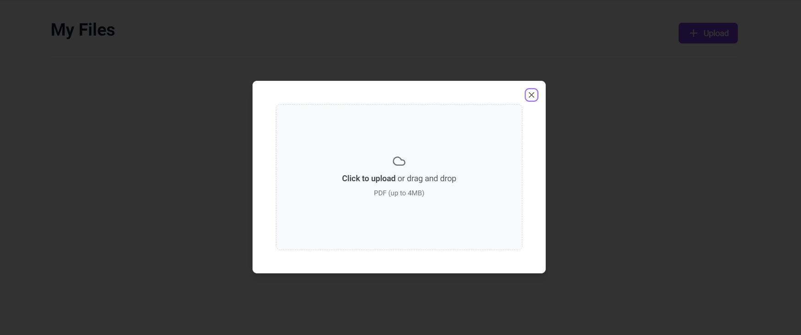
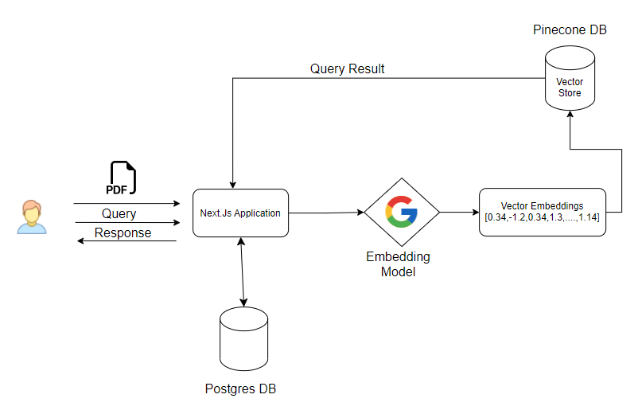

# Askify - AI-Powered PDF Query SaaS





**Askify** is a cutting-edge AI SaaS application designed to allow users to upload PDF documents and query them using advanced AI models. The platform streamlines the process of extracting meaningful insights and answers from large PDF documents, making it ideal for researchers, professionals, and anyone handling a large amount of textual data.

## Project Flow


## 🚀 Features

- **PDF Uploading**: Users can securely upload PDFs through an intuitive interface.
- **AI-Powered Queries**: Powered by Grmini and LangChain, Askify allows users to ask natural language questions related to their uploaded documents and get accurate answers.
- **Real-Time Results**: Fast and efficient AI responses, thanks to the seamless integration with PineconeDB for vector storage and quick search.
- **Authentication**: Secure user authentication and access control using Clerk.
- **Responsive Design**: Built with a responsive and sleek UI to ensure usability across devices.
- **Subscription Plans**: Offer both free and pro subscription tiers with stripe integration for handling payments.

## 🛠️ Tech Stack

- **Frontend**: [Next.js](https://nextjs.org/) + [shadcn](https://shadcn.dev/) - Modern React framework combined with a flexible and accessible UI component library.
- **Authentication**: [Clerk](https://clerk.dev/) - Easy and secure user management.
- **Database**: PostgreSQL - Highly scalable and secure database solution.
- **Vector Search**: [PineconeDB](https://www.pinecone.io/) - Fast, scalable vector search engine for querying embeddings.
- **AI Models**: [Google Gemini Model](https://js.langchain.com/docs/integrations/platforms/google/) + [LangChain](https://js.langchain.com/docs/introduction/) - Natural language processing and query understanding.
- **Payments & Subscriptions**: [Stripe](https://stripe.com/) - Payment processing for subscription plans (Free and Pro).
- **Storage**: Cloudinary is used for pdf storage.
- **Deployment**: Deployed on Vercel.

## 🛠️ Local Development

To run this project locally, follow these steps:

### Prerequisites

- Node.js (v14 or higher)
- npm or yarn
- A `.env` file with the necessary environment variables (see `.env.example` for reference)

### Installation

1. Clone the repository:

   ```sh
   git clone https://github.com/Devankit-Sahu/askify.git
   cd askify
   ```

2. Install dependencies:

   ```sh
   npm install
   # or
   yarn install
   ```

3. Set up environment variables:

   Copy the `.env.example` file to `.env` and fill in the required values.

   ```sh
   copy .env.example .env
   ```

### Running the Application

1. Start the development server:

   ```sh
   npm run dev
   # or
   yarn dev
   ```

2. Open your browser and navigate to `http://localhost:3000`.
